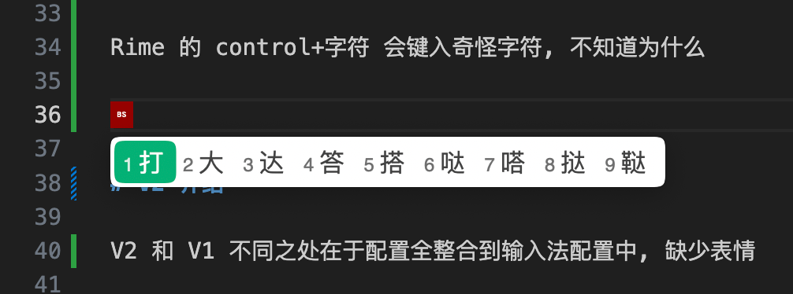

# Rime 配置文件介绍

首先，要有一个核心思想：Rime 不是输入法，是输入法引擎，Rime 管理着各个输入法

按照这个思路 Rime 的配置文件结构就清晰多了, 分为 Rime 全局配置、以及各个输入法配置

Rime 全局配置文件：
- default.(custom).yaml：
	- 输入法方案
	- 方案切换
	- 中英文切换
	- 翻页及其他快捷键
	- 符号替换
	- 特殊字符匹配
- squirrel.(custom).yaml：
	- 主题选择
	- 主题样式库
	- 特定软件的中英文状态
- installation.yaml：同步相关，详见[RIMERIME 输入法使用体验](https://zhaohongxuan.github.io/2024/03/20/most-powerful-input-method-rime/)

输入法配置文件：
- luna_pinyin_simp.custom.yaml（有些选项写在这里也能生效）
	- 默认中英文状态
	- 候选个数

说实话, 感觉还是很乱

# V1 介绍

V1 的配置分别写到 `default.custom.yaml`、`squirrel.custom.yaml`、`luna_pinyin_simp.custom.yaml` 文件中

V1 无法 `control+[` 触发 ascii_mode, Vim 模式只能用 Esc 退出

Rime 的 control+字符 会键入奇怪字符, 不知道为什么

# V2 介绍

V2 和 V1 不同之处在于配置全整合到输入法配置中, 缺少表情